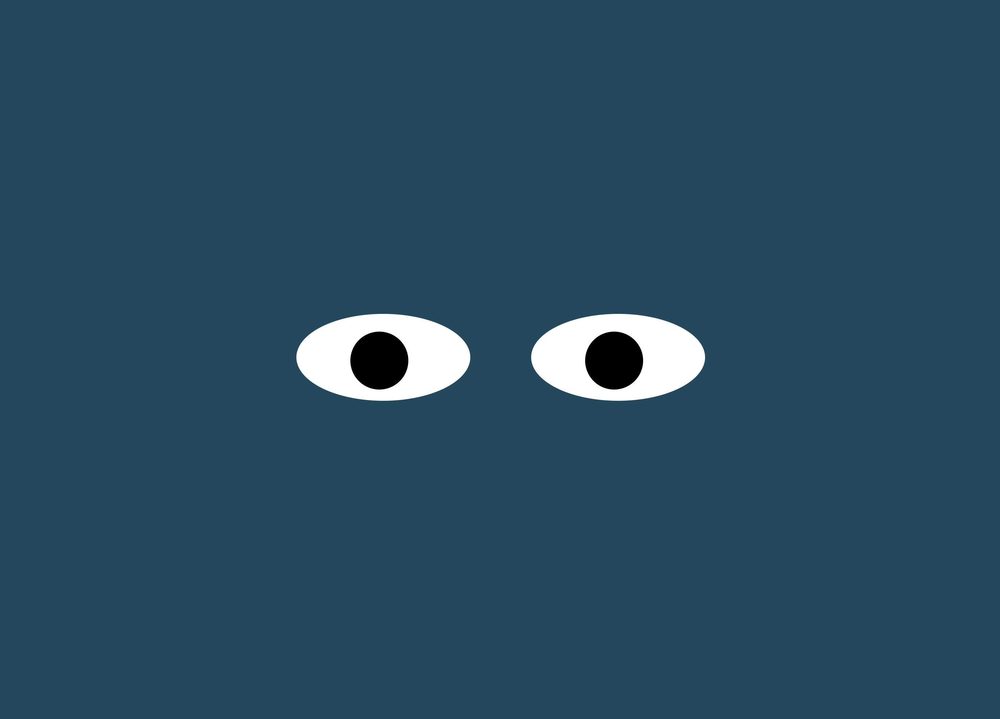

# Eye Exercise

## Project Description
he original objective was to have a single eye track the location of the user's cursor. For an added layer of complexity, a second tracking eye is added for the eyes to look human. Both eyes are kept in sync thanks to a for-loop.

## How to Run
To run the program, begin by downloading this repository. Once installed, open index.html in a new browser tab and the two eyes will render upon launch. Move your cursor across the browser window to see the eyes track it. 

## Roadmap of Future Improvements
Future improvements can be adding a button to pause and resume the tracking, as well as creating a factory function to populate the program with more eyes. 

## License
MIT License

Permission is hereby granted, free of charge, to any person obtaining a copy of this software and associated documentation files (the "Software"), to deal in the Software without restriction, including without limitation the rights to use, copy, modify, merge, publish, distribute, sublicense, and/or sell copies of the Software, and to permit persons to whom the Software is furnished to do so, subject to the following conditions:

The above copyright notice and this permission notice shall be included in all copies or substantial portions of the Software.

THE SOFTWARE IS PROVIDED "AS IS", WITHOUT WARRANTY OF ANY KIND, EXPRESS OR IMPLIED, INCLUDING BUT NOT LIMITED TO THE WARRANTIES OF MERCHANTABILITY, FITNESS FOR A PARTICULAR PURPOSE AND NONINFRINGEMENT. IN NO EVENT SHALL THE AUTHORS OR COPYRIGHT HOLDERS BE LIABLE FOR ANY CLAIM, DAMAGES OR OTHER LIABILITY, WHETHER IN AN ACTION OF CONTRACT, TORT OR OTHERWISE, ARISING FROM, OUT OF OR IN CONNECTION WITH THE SOFTWARE OR THE USE OR OTHER DEALINGS IN THE SOFTWARE.

